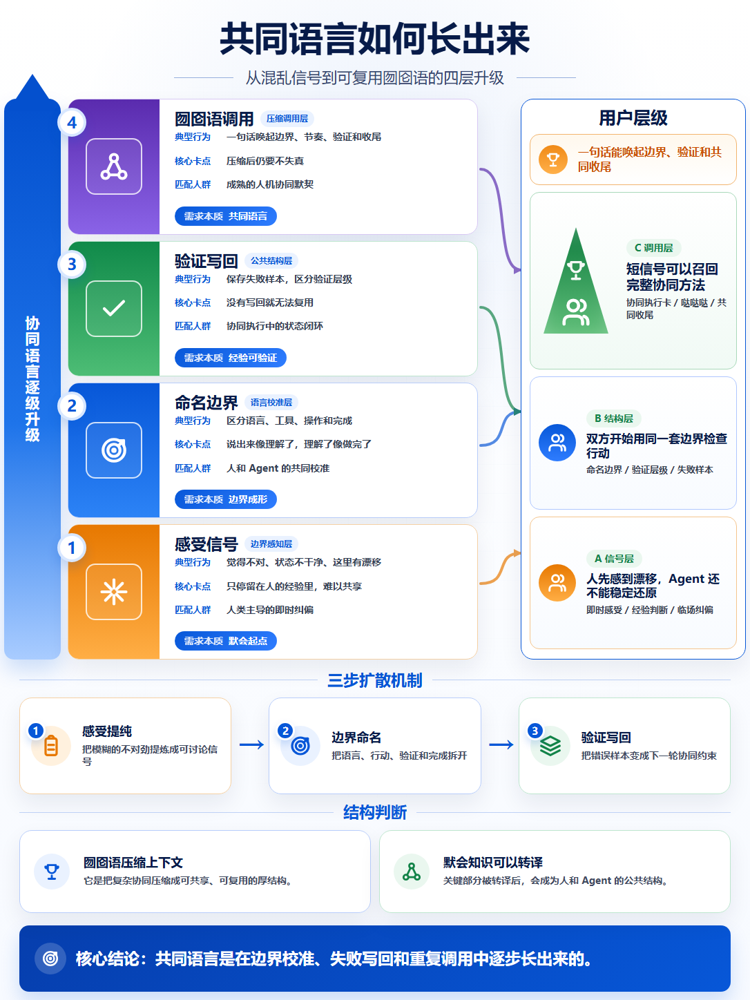
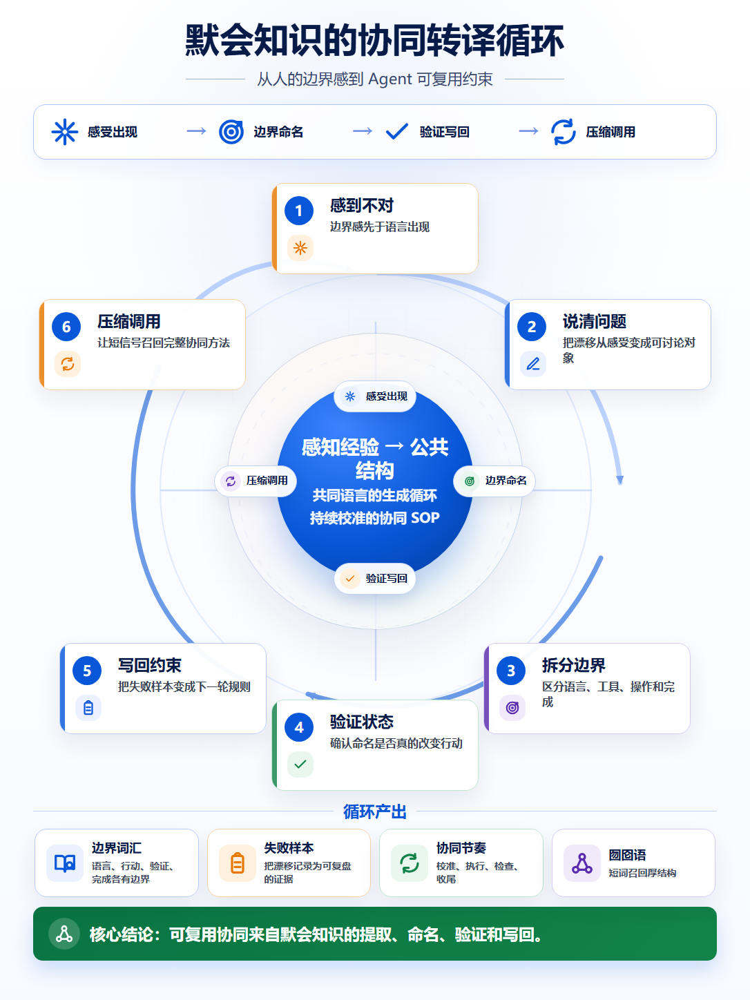
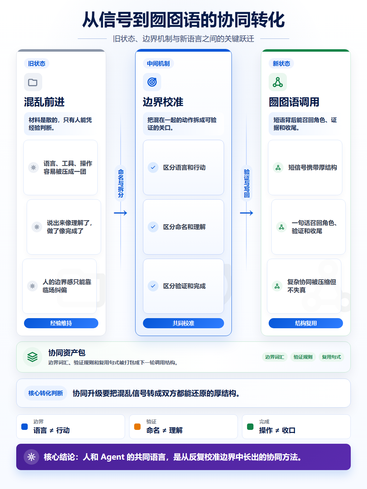
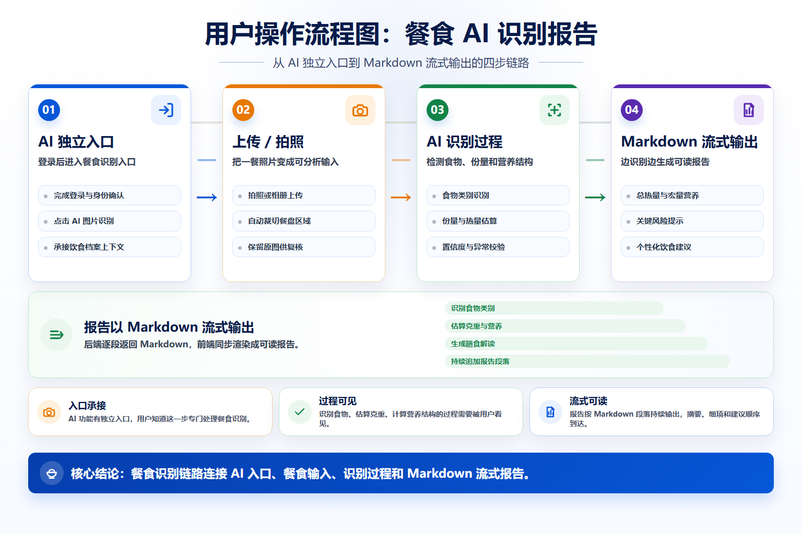

# PicTalk


[中文 README](./README.md)

PicTalk is an Agent Skill for turning articles, reports, meeting notes, and product documents into presentation-ready infographics.

When a document needs to be explained to other people, a clear image often works better than another long paragraph. PicTalk reads the source, extracts the structure, chooses a diagram pattern, and renders one or more visual cards that can be used in a deck, article, or team memo.

## What it does

- Extracts the main structure from articles, Markdown, meeting notes, PDF summaries, or pasted text.
- Chooses diagram patterns such as hierarchy, flow, cycle, transformation, timeline, and matrix.
- Generates Chinese or English infographics for reports, product explainers, article visuals, and presentations.
- Renders final images with HTML/CSS templates, which keeps dense text, numbers, and headings stable.
- Includes storyboard JSON, rendering scripts, and QA scripts so outputs can be regenerated and edited.

## Examples

### Hierarchy diffusion



### Collaboration cycle



### Transformation logic



### User operation flow



Example assets live in `docs/images/`. Their storyboard sources are `docs/images/storyboard.json` and `docs/images/meal-flow-storyboard.json`.

## Quick start

### Claude Code

```bash
git clone https://github.com/nooqle/PicTalk.git
cp -r PicTalk/pictalk ~/.claude/skills/pictalk
```

Then ask:

```text
Use PicTalk to turn this article into 3 Chinese infographics for a presentation.
```

### Codex

Place `pictalk/` in your Codex skills directory and use:

```text
Use $pictalk to turn this article into presentation-ready infographics.
```

### Run locally

The repo includes runnable example storyboards:

```bash
python pictalk/scripts/validate_storyboard.py docs/images/storyboard.json
python pictalk/scripts/render_storyboard.py docs/images/storyboard.json --output-dir docs/images
```

Render the process-flow example:

```bash
python pictalk/scripts/validate_storyboard.py docs/images/meal-flow-storyboard.json
python pictalk/scripts/render_storyboard.py docs/images/meal-flow-storyboard.json --output-dir docs/images
```

## Prompt examples

```text
Turn this article into one infographic that explains the main argument.
```

```text
Make 3 visuals from this product brief: one flow, one capability map, one conclusion card.
```

```text
Create a visual summary from these meeting notes. Keep the important numbers and product names.
```

```text
Generate a vertical 3:4 Chinese infographic from this Markdown document.
```

## Workflow

PicTalk follows a small workflow:

1. Read the source and identify the topic, claims, phases, actors, relations, and conclusion.
2. Decide how many images are needed.
3. Pick a diagram pattern and create a storyboard.
4. Render PNG images from the HTML/CSS template.
5. Run QA scripts for structure, size, and rendered text coverage.

For quick work, ask the Agent to run the full flow. For precise edits, modify the storyboard and render again.

## Layouts

### Premium layouts

| Layout | Best for |
| --- | --- |
| `premium-hierarchy-diffusion` | levels, maturity models, capability stacks, demand upgrades |
| `premium-cycle-system` | feedback loops, operating flywheels, collaboration cycles |
| `premium-transformation-logic` | old state to new state, problem to solution, signal to structure |
| `premium-process-flow` | user journeys, product flows, AI pipelines, streaming output |

### General layouts

| Layout | Best for |
| --- | --- |
| `arrow-flow` | workflows, operating steps, handoffs |
| `timeline` | phases, versions, event sequences |
| `matrix` | comparison, priority, ownership |
| `layer-stack` | layered structures, capability levels, maturity stages |
| `cycle` | loops and continuous improvement |
| `comparison` / `transformation` | comparisons and solution explanations |

## Design system

PicTalk uses a restrained presentation style:

- Vertical `1086x1448` canvas for article visuals and long cards.
- Wide `1536x1024` canvas for process diagrams and slides.
- Deep navy as the main color, with green, orange, and purple for semantic accents.
- Consistent radius, borders, shadows, and spacing.
- Icons, numbers, arrows, connectors, and conclusion bands show the structure before the reader studies every line.

Default colors:

| Role | Hex |
| --- | --- |
| title navy | `#071B49` |
| primary blue | `#0757D8` |
| green | `#128348` |
| orange | `#E77800` |
| purple | `#5A2BAE` |
| text | `#111827` |
| border | `#BFD2F5` |
| background | `#FFFFFF` |

## Project structure

```text
pictalk/
├── SKILL.md
├── agents/
│   ├── openai.yaml
│   └── generic.yaml
├── assets/
│   ├── storyboard-template.json
│   └── template-infographic.html
├── references/
│   ├── layouts.md
│   ├── pattern-library.md
│   ├── storyboard-schema.md
│   ├── style-guide.md
│   ├── text-accuracy.md
│   └── image-prompts.md
└── scripts/
    ├── validate_storyboard.py
    ├── render_storyboard.py
    ├── qa_rendered_html.py
    ├── qa_benchmark_image.py
    └── analyze_layout_alignment.py

docs/
├── images/
│   ├── card-01.png
│   ├── card-02.png
│   ├── card-03.png
│   ├── meal-flow.png
│   ├── storyboard.json
│   └── meal-flow-storyboard.json
└── pictalk-premium-layout-design.md
```

## QA

Common checks:

```bash
python pictalk/scripts/validate_storyboard.py docs/images/storyboard.json
python pictalk/scripts/render_storyboard.py docs/images/storyboard.json --output-dir docs/images --keep-html
python pictalk/scripts/qa_rendered_html.py docs/images/card-01.html docs/images/card-02.html docs/images/card-03.html
```

If you have a reference image, compare bounds, whitespace, and content coverage:

```bash
python pictalk/scripts/qa_benchmark_image.py benchmark.png docs/images/card-01.png
```

## License

MIT. See [LICENSE](./LICENSE).
