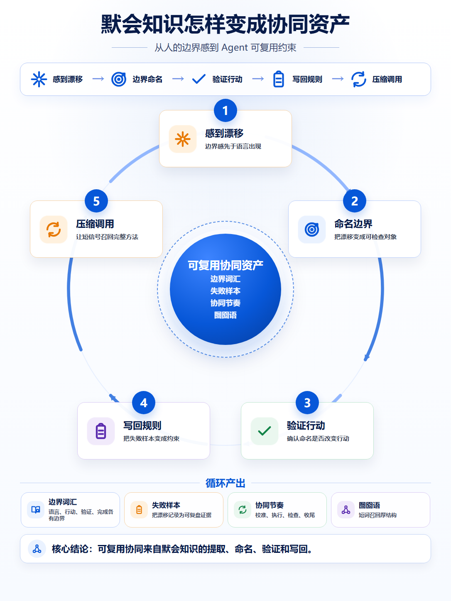
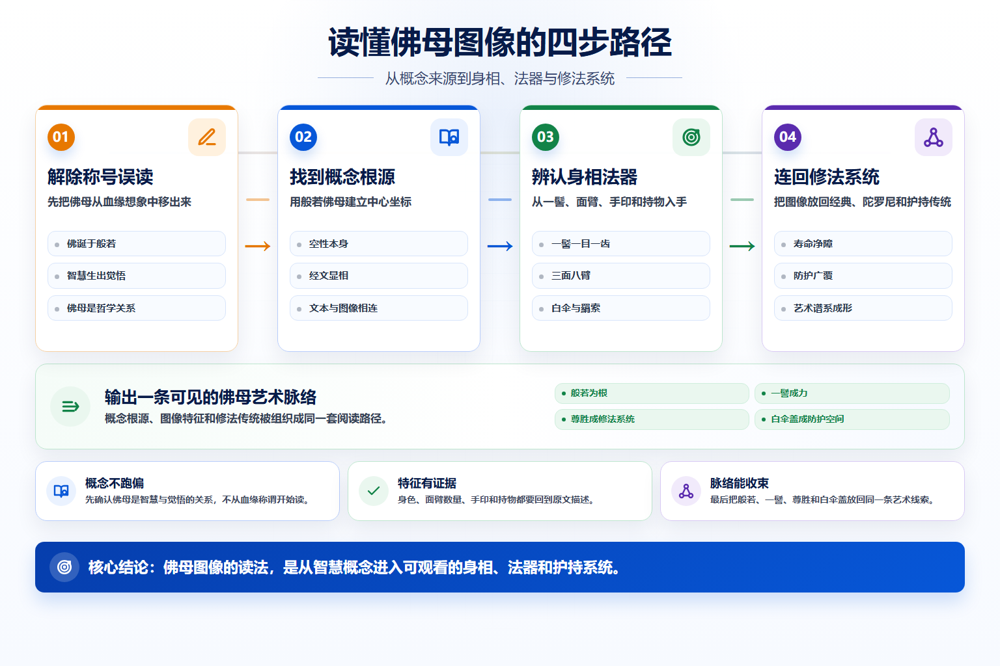
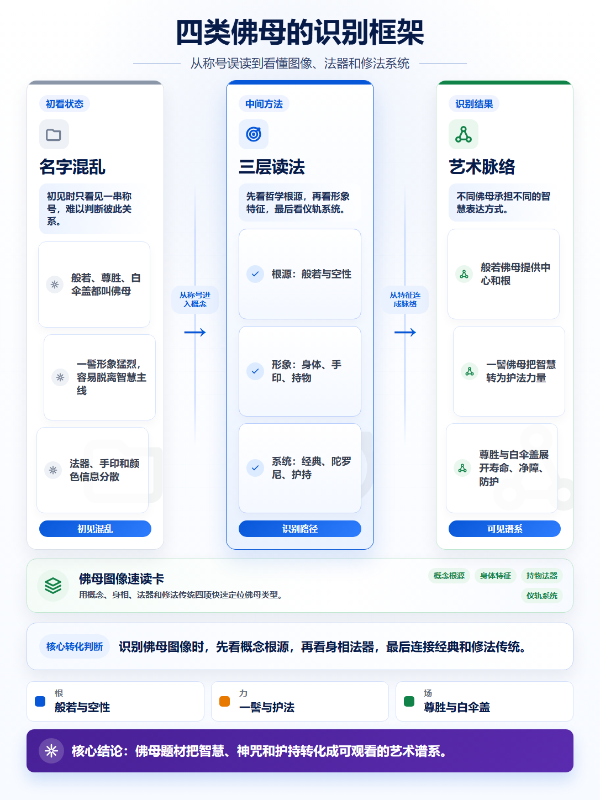

# PicTalk


[English README](./README.en.md)

PicTalk 是一个 Agent Skill，用来把文章、报告、会议纪要和产品说明生成信息图。

它解决的是一个很常见的展示问题：内容已经写完了，但读者需要先看到结构。PicTalk 会读取素材，提炼论点和关系，选择合适的图式，输出一张或几张可以放进文章、汇报或演示里的信息图。

## 快速开始

### Codex

PowerShell:

```powershell
git clone https://github.com/nooqle/PicTalk.git
New-Item -ItemType Directory -Force "$env:USERPROFILE\.codex\skills" | Out-Null
Copy-Item -Recurse -Force ".\PicTalk\pictalk" "$env:USERPROFILE\.codex\skills\pictalk"
```

bash:

```bash
git clone https://github.com/nooqle/PicTalk.git
mkdir -p ~/.codex/skills
cp -R PicTalk/pictalk ~/.codex/skills/pictalk
```

使用时可以这样说：

```text
Use $pictalk to turn this article into presentation-ready infographics.
```

### Claude Code

PowerShell:

```powershell
git clone https://github.com/nooqle/PicTalk.git
New-Item -ItemType Directory -Force "$env:USERPROFILE\.claude\skills" | Out-Null
Copy-Item -Recurse -Force ".\PicTalk\pictalk" "$env:USERPROFILE\.claude\skills\pictalk"
```

bash:

```bash
git clone https://github.com/nooqle/PicTalk.git
mkdir -p ~/.claude/skills
cp -R PicTalk/pictalk ~/.claude/skills/pictalk
```

安装后可以这样说：

```text
用 PicTalk 把这篇文章做成 3 张中文信息图，适合放进汇报。
```

## 示例

### 抽象方法论变成循环图



### 文章内容变成阅读路径



### 框架型文章变成识别图



更多示例在 [docs/images](./docs/images)。示例分镜包括：

- [article-examples-20260606-storyboard.json](./docs/images/article-examples-20260606-storyboard.json)
- [storyboard.json](./docs/images/storyboard.json)
- [buddhist-mother-storyboard.json](./docs/images/buddhist-mother-storyboard.json)
- [meal-flow-storyboard.json](./docs/images/meal-flow-storyboard.json)

## 适合什么内容

- 公众号文章、博客文章、方法论长文
- 产品说明、功能流程、AI 工作流
- 会议纪要、调研材料、项目复盘
- 报告摘要、策略材料、培训材料
- 需要保留专有名词、数字和中文标题的信息图

## 常用请求

```text
把这篇文章转成一张能讲清核心逻辑的信息图。
```

```text
把这份产品说明做成 3 张图：一张流程图，一张能力结构图，一张结论图。
```

```text
把这段会议纪要做成可视化总结，保留关键数字和专有名词。
```

```text
基于这份 Markdown 生成一张 3:4 竖版中文信息图。
```

## 工作方式

PicTalk 的基本流程：

1. 读取素材，识别主题、论点、阶段、角色、关系和结论。
2. 判断需要输出几张图。
3. 选择图式，生成 storyboard JSON。
4. 使用 HTML/CSS 模板渲染 PNG。
5. 运行校验脚本，检查结构、尺寸、文本和布局。

如果只想快速出图，可以让 Agent 直接完成整套流程。如果需要精修，可以修改 storyboard 后重新渲染。

## 图式

### Premium 图式

| 图式 | 适合内容 |
| --- | --- |
| `premium-hierarchy-diffusion` | 层级、成熟度、能力栈、结构升级 |
| `premium-cycle-system` | 反馈循环、运营飞轮、协同循环 |
| `premium-transformation-logic` | 旧状态到新状态、问题到方案、信号到结构 |
| `premium-process-flow` | 操作流程、产品流程、AI 处理管线、流式输出 |

### 通用图式

| 图式 | 适合内容 |
| --- | --- |
| `arrow-flow` | 任务流程、操作步骤、交接链路 |
| `timeline` | 时间线、版本节奏、事件顺序 |
| `matrix` | 分类对比、优先级、责任划分 |
| `layer-stack` | 分层结构、能力等级、成熟度 |
| `cycle` | 循环机制、持续改进 |
| `comparison` / `transformation` | 对比、转化、方案说明 |

## 设计原则

- 先确定内容关系，再选择图式。
- 一张图只承载一个主要结构，例如层级、流程、循环、转化或矩阵。
- 可见文字由 storyboard 提供，中文、数字、日期和专有名词优先使用确定性文本渲染。
- 每个视觉锚点使用一个与内容相关的语义图标；几何底纹可以变化，但不堆叠多个图标。
- 颜色按语义使用：蓝色表示主线，绿色表示产出或系统，橙色表示警示或转折，紫色表示高级层级或扩展。
- 默认不加水印，方便直接用于文章和汇报。

默认色彩：

| 角色 | 色值 |
| --- | --- |
| 标题深蓝 | `#071B49` |
| 主蓝 | `#0757D8` |
| 绿色 | `#128348` |
| 橙色 | `#E77800` |
| 紫色 | `#5A2BAE` |
| 正文 | `#111827` |
| 边框 | `#BFD2F5` |
| 背景 | `#FFFFFF` |

## 本地渲染

需要 Python 和 Playwright：

```bash
pip install playwright
playwright install chromium
```

渲染示例：

```bash
python pictalk/scripts/validate_storyboard.py docs/images/storyboard.json
python pictalk/scripts/render_storyboard.py docs/images/storyboard.json --output-dir docs/images --keep-html
python pictalk/scripts/qa_rendered_html.py docs/images/card-01.html docs/images/card-02.html docs/images/card-03.html
```

## 项目结构

```text
pictalk/
├── SKILL.md
├── assets/
│   ├── storyboard-template.json
│   └── template-infographic.html
├── references/
│   ├── layouts.md
│   ├── pattern-library.md
│   ├── storyboard-schema.md
│   ├── style-guide.md
│   ├── text-accuracy.md
│   └── image-prompts.md
└── scripts/
    ├── validate_storyboard.py
    ├── render_storyboard.py
    ├── qa_rendered_html.py
    ├── qa_benchmark_image.py
    └── analyze_layout_alignment.py

docs/
└── images/
    ├── *.png
    └── *storyboard.json
```

## License

MIT. See [LICENSE](./LICENSE).
